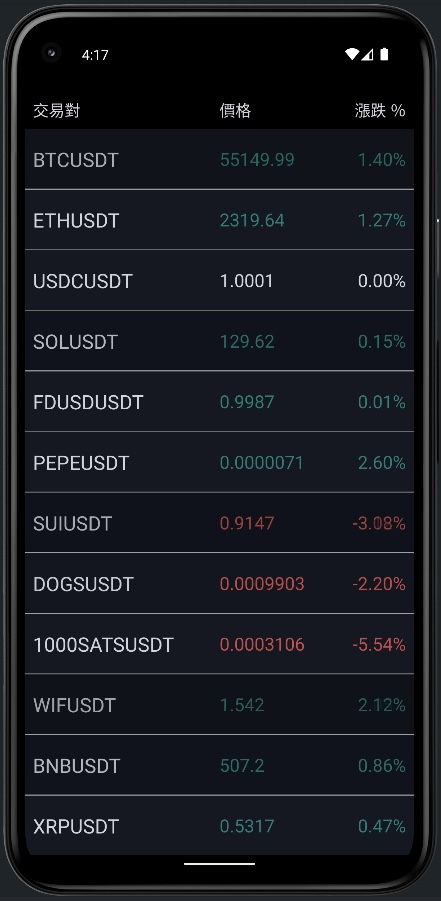

# BinanceTicker

### 專案簡介

BinanceTicker 是一個 Android 應用程式，用於顯示 Binance 交易所中交易量由大至小的前 100 名交易對。
透過串接 Binance API 和 Binance WebSocket 實時更新顯示最新的價格、漲跌幅和交易量資訊，
並使用 TradingView Lightweight Charts 來展示歷史和即時 K 線走勢。

---

### 功能

#### 1. 實時顯示交易對資訊：

- 從 Binance API 獲取交易量由小至大的交易對前 100 名，並使用 RecyclerView 進行展示。
- 每個交易對的名稱、價格及漲跌幅皆會即時更新，透過 Binance WebSocket 獲取最新報價。

#### 2. 交易對詳細頁面：

- 點擊 RecyclerView 中的交易對進入詳細頁面。
- 詳細頁面展示了選中的交易對的價格、交易量和漲跌幅，並透過 Binance WebSocket 實時更新。
- 在頁面底部嵌入了 TradingView Lightweight Chart，以 K 線圖展示歷史與即時價格資訊。該 K 線圖的數據來自 Binance API 的歷史 K 線與 WebSocket 的最新數據。

---

### 技術架構

專案採用了 MVVM 架構，並遵循 Clean Architecture 原則進行分層。核心功能使用了以下技術：

- Kotlin
- MVVM 
- ViewBinding
- XML Layout
- Dagger Hilt
- Coroutines
- LiveData
- Flow
- [OkHttp](https://github.com/square/okhttp)
- [Retrofit](https://github.com/square/retrofit)
- [Kotlinx Serialization](https://github.com/Kotlin/kotlinx.serialization/)
- [TradingView Lightweight Chart](https://github.com/tradingview/lightweight-charts)

---

### 展示圖

